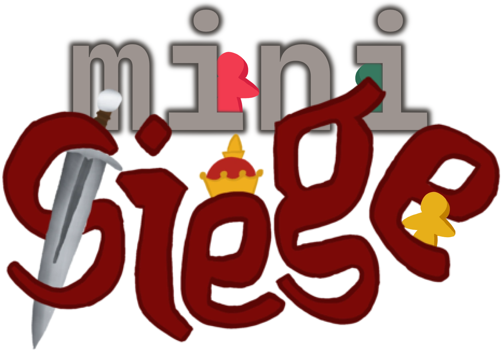

# minisiege



A short browser-based text adventure game where you survive a 10-week siege in the world of Hack Club.

## (really simple) overview

10 weeks of sieging: each week presents an opportunity. Each decision affects your health and coin count. Survive all 10 weeks and maximise your loot.

Built in Vite + TailwindCSS

## running locally

### prequisites

- Node.js (version 20.19+)
- npm / your favourite package manager :3

### setup

```bash
git clone https://github.com/junyali/minisiege.git
cd minisiege
npm install
npm run dev
```


Inspired by Siege - a Hack Club YSWS event.
